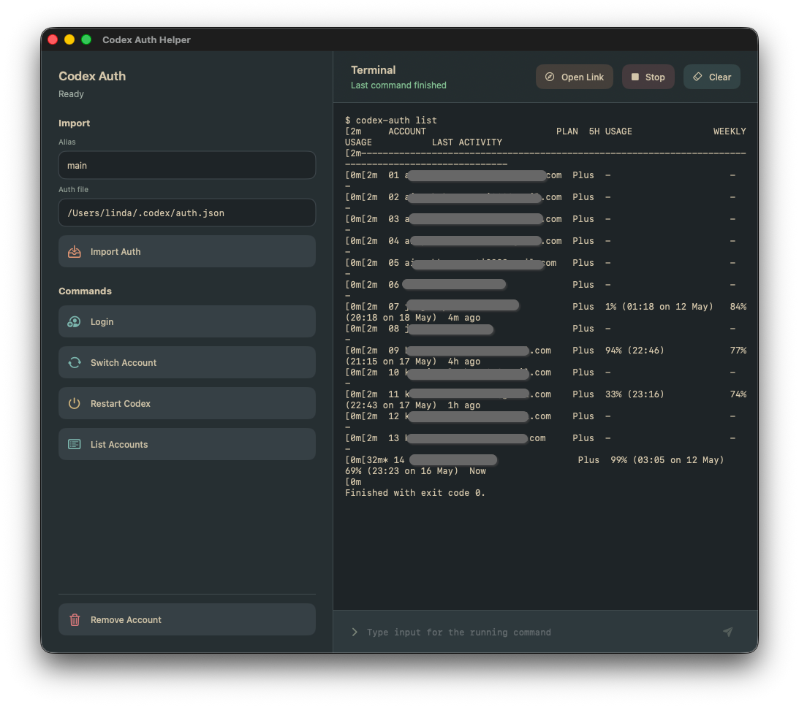
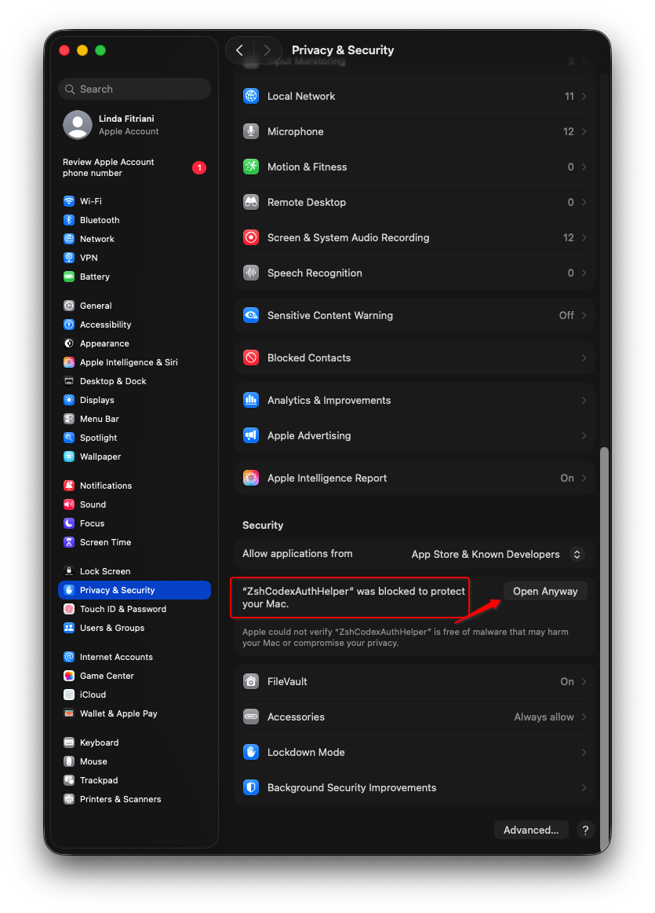

# Codex Auth Helper

**Codex Auth Helper** is a small macOS app for managing Codex accounts without memorizing `codex-auth` commands.

It gives Codex App users a simple interface for login, save/update, switch, list, remove, restart, open, and force-close flows, while still showing the real terminal output so you always know what is happening.



## Why Use It

- Switch Codex accounts faster from a desktop app.
- Use `codex-auth` without typing the same commands again and again.
- Save or update an auth file. You can add a clear alias, such as `main`, `work`, or `personal`, but the alias is optional when updating an existing account.
- See command output inside the app, including prompts you may need to answer.
- Open detected login links in Chrome Incognito from the built-in terminal panel.
- Restart, open, or force-close Codex App without mixing those actions together.

Think of it as a control panel for `codex-auth`: the app gives you buttons and a terminal view, while `codex-auth` still does the account management.

## Features

- **Login**: runs `codex-auth login --device-auth`, which saves the account through codex-auth's isolated login flow.
- **Save / Update Login**: saves an auth JSON file. Leave the alias blank to update an existing saved account without changing its alias.
- **Switch Account**: prepares `codex-auth switch` so you can type the alias.
- **Search saved accounts**: filter the saved-account list by email, alias, account name, plan, or auth mode.
- **Open Blank Incognito**: opens a blank Chrome Incognito window from the sidebar, using your normal Chrome profile so Chrome can still offer saved passwords and passkeys.
- **List Accounts**: shows accounts managed by `codex-auth`.
- **Health Check**: checks every saved ChatGPT OAuth account one at a time, refreshes valid tokens, and ends with sorted account summaries.
- **Update codex-auth**: installs or updates the app-owned `codex-auth` tool without changing your global terminal copy.
- **Remove Account**: prepares `codex-auth remove` so you can type the alias.
- **Restart ChatGPT**: quits the ChatGPT desktop app, waits for its Codex helper processes to exit, and then reopens it after account changes.
- **Open / Force Close ChatGPT**: shows the right action for the current ChatGPT desktop app state.
- **Interactive terminal**: send input to running commands from the app.
- **Link detection**: open the latest detected login link in Chrome Incognito with one click.
- **One-time code detection**: copy detected login codes with one click.
- **Configurable Codex path**: set the Codex resources path in Settings if Codex App is installed somewhere else.
- **Theme settings**: choose Everforest Dark or Light, with Hard, Medium, or Soft contrast.

## Requirements

- macOS 26 or newer.
- Codex App installed.
- Node.js and npm.
- The app can install its own [`codex-auth`](https://github.com/loongphy/codex-auth) copy. A global install is only a fallback.
- For source builds: Xcode 26 and XcodeGen.

Optional global fallback install:

```bash
npm install -g @loongphy/codex-auth@latest
```

## Install

### Install From DMG

For most users, this is the easiest way to install or update the app. You do not need Xcode.

Open the [latest GitHub release](https://github.com/withLinda/zsh-codex-auth-helper/releases/latest), then go to **Assets** and download the newest DMG file. For this release, download:

- `CodexAuthHelper-v2026.07.10.1.dmg`

Do not use the **Source code** downloads for normal installation. Those files are only the project source.

If you also want to check the download, download the matching checksum file too:

- `CodexAuthHelper-v2026.07.10.1.dmg.sha256`

The `.dmg` file is the installer. The `.sha256` file lets you check that the download was not damaged. Put both files in the same folder, then run this command from that folder:

```bash
shasum -a 256 -c CodexAuthHelper-v*.dmg.sha256
```

Then install it:

1. Open the downloaded `.dmg` file.
2. Drag `ZshCodexAuthHelper.app` to the `Applications` shortcut in the DMG window.
3. If Finder asks whether to replace an older copy, choose **Replace**.
4. Open `Codex Auth Helper` from `Applications`.

The DMG is Developer ID-signed and notarized. If macOS still shows a warning on first launch, right-click `Codex Auth Helper`, choose **Open**, then choose **Open** again.

If macOS says `ZshCodexAuthHelper` was blocked, open **System Settings > Privacy & Security**, then click **Open Anyway**.



### Build From Source

Install XcodeGen if you do not already have it:

```bash
brew install xcodegen
```

Then build and run the app from the project folder:

```bash
./script/build_and_run.sh
```

## Quick Start

Use this flow the first time:

1. Open **Codex Auth Helper**.
2. Click **Update codex-auth**. This installs the app-owned tool into `~/Library/Application Support/CodexAuthHelper/codex-auth-tool`.
3. Click **Login**.
4. If the terminal shows a login link, click **Open Incognito**. If it shows a one-time code, click **Copy Code** and paste it into the browser page.
5. Finish the login in the browser. When login succeeds, `codex-auth` saves the account automatically.
6. If you want to set or change an alias, use **Save / Update Login**. The default auth file is `~/.codex/auth.json`.
7. Click **List Accounts** to confirm the saved account appears.
8. Click **Switch Account...**, type the alias, email, account name, or row number, then press Return.
9. Click **Restart ChatGPT** so the ChatGPT desktop app fully reloads with the selected Codex account.

## Complete Usage Guide

### Saved Login Area

- **Auth account status** shows the account found in the selected auth file. If it says **No auth file**, **Unreadable auth**, or **No signed-in account**, the selected auth file needs attention.
- **Alias (optional)** is a short name for a saved account, such as `main`, `work`, or `personal`. For a new account, a clear alias makes switching easier. For an existing account, you can leave the alias blank to update the saved login without changing its alias.
- **Auth file** is the file to save or update. The normal Codex file is `~/.codex/auth.json`.
- **Save / Update Login** runs `codex-auth import <auth-file>`. Use it after logging in, after reauthenticating, or after changing the auth file path.

### Command Buttons

- **Login** runs `codex-auth login --device-auth`. It signs in through the browser using an isolated codex-auth login flow, then saves the finished login through `codex-auth`. Use **Save / Update Login** only when you want to set an alias manually or update a chosen auth file.
- **Open Blank Incognito** opens a blank Chrome Incognito window. It uses the same Chrome profile as your normal Chrome app, so saved passwords and passkeys can still be offered by Chrome.
- **Switch Account...** prepares `codex-auth switch` in the terminal input. Add an alias, full email, email fragment, account name, or row number from **List Accounts**, then press Return. The app checks the selected saved login before switching. For OAuth accounts, it refreshes only when Codex would need renewal now: when the access token is expired or within five minutes of expiry, or when expiry cannot be read and `last_refresh` is older than eight days. If the saved access token is still fresh, Switch does not ask OpenAI and does not spend the refresh token. If `~/.codex/auth.json` is a newer matching login, the app copies it into the saved account file first. The terminal prints safe `Switch check:` lines, but never prints full tokens. If OpenAI accepts a needed refresh, the app saves the new rotated token, then runs `codex-auth switch`. If a needed refresh finds an expired, already used, or revoked token, the wrong saved file, or a save failure, the switch is blocked. API-key accounts skip OAuth refresh because they do not use refresh tokens. If more than one account matches, use a more specific value.
- **Restart ChatGPT** quits the ChatGPT desktop app, waits for its Codex helper processes to exit, and opens it again. Use this after switching accounts. A simple way to think about it: switching changes the key on disk, and restarting makes Codex pick up the new key.
- **Open ChatGPT** appears when the ChatGPT desktop app is closed. It opens ChatGPT without changing accounts.
- **Force Close ChatGPT** appears when the ChatGPT desktop app is open. Use it only when ChatGPT is stuck, did not close during restart, or Codex still seems to be using the wrong account. It can kill the app processes directly.
- **List Accounts** runs `codex-auth list`. Use it to see saved accounts and row numbers.
- **Search saved accounts** filters the visible saved-account rows. Search by email, alias, account name, plan, or auth mode. Empty search text shows every saved account again.
- **Update codex-auth** runs `npm install --global --prefix ~/Library/Application Support/CodexAuthHelper/codex-auth-tool @loongphy/codex-auth@latest` or `@next`, depending on the Settings channel. It updates only the app-owned tool. It does not run `sudo` and does not change your global terminal `codex-auth`.
- **Health Check** checks saved ChatGPT OAuth accounts. See the next section for details and timing.
- **Remove Account** prepares `codex-auth remove` in the terminal input. Add the alias or selector, then press Return. This removes the saved account from `codex-auth`; it does not delete your OpenAI account.

### Terminal Panel

- The terminal shows the real command and output. Read it when something fails, because it usually explains the next step.
- When a command is running, the input box sends text to that command. Use it for prompts that need an answer.
- When no command is running, the input box accepts only prepared **Switch Account...** or **Remove Account** commands.
- **Open Incognito** appears when the terminal detects a login link. It opens the latest detected HTTP or HTTPS link in Google Chrome Incognito.
- **Copy Code** appears when the terminal detects a one-time login code.
- **Stop** stops the running command.
- **Clear** clears the terminal output in the app. It does not delete saved accounts.

### Settings

If the ChatGPT desktop app is not installed at `/Applications/ChatGPT.app`, open **Codex Auth Helper > Settings** and update **Codex resources path**. Old `/Applications/Codex.app` installs still work.

The default path is:

```text
/Applications/ChatGPT.app/Contents/Resources
```

Settings also has a `codex-auth` update channel:

- **Stable** installs `@loongphy/codex-auth@latest`. This is the safer normal choice.
- **Next Alpha** installs `@loongphy/codex-auth@next`. This can get new features sooner, but it can break more often.

The app always looks for its app-owned `codex-auth` first. If it is missing, the app falls back to global locations such as `/opt/homebrew/bin/codex-auth`.

## Health Check

**Health Check** is for saved ChatGPT OAuth accounts. API-key accounts are skipped because they do not use OAuth refresh tokens.

What it does:

- Reads the accounts saved by `codex-auth`.
- Checks each saved ChatGPT OAuth account one at a time.
- Sends a refresh request to OpenAI's auth server for each OAuth account.
- Writes the new rotated refresh token immediately when the refresh succeeds.
- Updates `~/.codex/auth.json` too when the refreshed account is the active account.
- Prints sorted summaries for accounts that need attention, accounts that were refreshed, and accounts that were skipped.

Rule of thumb:

- Run **Health Check about once per week** for normal multi-account use.
- Also run it before a long or important Codex session, after adding or updating accounts, after a failed switch or login, or before using an account that has been idle for a long time.
- You do not need **Health Check** after every small switch. **Switch Account...** checks only the selected account and refreshes it only when Codex would need renewal now. **Health Check** validates every saved OAuth account, so it is still useful before important work or about once per week.

Benefits:

- Finds stale saved logins before you need them.
- Reduces surprise login failures during work.
- Keeps saved OAuth tokens fresh.
- Gives a clear account summary in the terminal.

Risks and tradeoffs:

- It makes extra auth-server requests. Running it too often is usually not useful.
- It writes local auth files when tokens refresh.
- It rotates tokens for every saved OAuth account it checks. **Switch Account...** rotates the selected OAuth account token only when that account needs renewal now. If a refresh is interrupted by a crash, power loss, or disk problem, you may need to log in again.
- If OpenAI has expired, revoked, or rejected a refresh token, Health Check cannot fix that account by itself. It will mark the account as needing login.

If an account needs login again, use **Login** and finish the browser login. Use **Save / Update Login** afterward only if you want to set or change an alias.

## Troubleshooting

- **Could not find npm**: install Node.js and npm, then reopen the app.
- **Could not find `codex-auth`**: click **Update codex-auth** first. If you prefer a global fallback, install it with `npm install -g @loongphy/codex-auth`, then reopen the app.
- **No auth file**: check that the **Auth file** field points to `~/.codex/auth.json`, or log in again.
- **Unreadable auth**: the selected auth file is not valid JSON or cannot be read. Log in again, then save the login.
- **No `codex-auth` registry was found**: use **Save / Update Login** or **List Accounts** so `codex-auth` can create or refresh its account registry.
- **Switch Account says more than one account matches**: run **List Accounts**, then switch with a full email, exact alias, or row number.
- **Switch Account says the refresh token was already used**: this can happen only when Switch had to refresh because the saved access token needed renewal. Click **Login**, finish browser login, then switch again. If this happens every time, read the `Switch check:` lines. They should show whether the saved account file was stale, whether `~/.codex/auth.json` was newer, whether saving the new token failed, or whether another Codex or `codex-auth` process probably used the token first.
- **Switch Account says the saved auth file does not match the selected account**: the saved file may belong to a different account. The app blocks the switch because switching from the wrong saved file is unsafe. Click **Login** for the selected account, then use **List Accounts** or **Save / Update Login** if you need to rebuild the saved registry or alias.
- **Chrome is missing**: install Google Chrome, or copy the login link from the terminal output and open it manually.
- **ChatGPT opens from the wrong place**: open **Codex Auth Helper > Settings** and set the Codex resources path for your ChatGPT or older Codex app install.
- **Health Check says `needs login`**: the saved login cannot refresh. Log in again, then save or update that account.
- **Codex still uses the old account after switching**: click **Restart ChatGPT**. Use **Force Close ChatGPT** only if the ChatGPT desktop app does not close normally.

## Built On codex-auth

This app is powered by [`loongphy/codex-auth`](https://github.com/loongphy/codex-auth), the original command-line tool for switching and managing Codex accounts.

Codex Auth Helper does not replace `codex-auth`. It makes the common `codex-auth` workflows easier to use from a macOS app.
